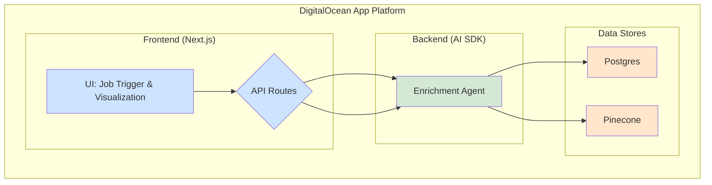

# Resilion Enrichment Pre-Loader POC: Engineering Development Plan

*Generated: 2025-06-28*  
*Last Updated: 2025-06-29*

---

## 1. High-Level Architecture Summary

The system will be a monorepo application composed of three main components:

*   **Next.js Frontend:** A web interface for triggering enrichment jobs, visualizing the workflow status via a Mermaid.js diagram, and reviewing the extracted data. It will communicate with the backend via API calls.
*   **AI SDK Backend (TypeScript/Node.js):** The core orchestration layer responsible for managing the enrichment workflow. It will handle job initialization, execute the multi-step enrichment chain (crawling, chunking, embedding, extraction, scoring), and persist results. It will expose API endpoints for the frontend.
*   **Data Stores:**
    *   **DigitalOcean Managed Postgres:** To store structured data, including enrichment job statuses, extracted facts (in JSONB format), and error logs.
    *   **Pinecone:** To store vector embeddings of the evidence text chunks for semantic search and retrieval.

The entire application will be deployed on the **DigitalOcean App Platform**, leveraging its integrated CI/CD capabilities.

---

## 2. Technology Stack Confirmation

The technology stack is confirmed as follows, aligning with the project's goals of rapid development, maintainability, and future scalability.

*   **Orchestration:** AI SDK (TypeScript)
*   **Frontend:** Next.js (React)
*   **Styling:** TailwindCSS + shadcn/ui component library
*   **Backend API:** Native Next.js API routes or standalone Node.js service
*   **Primary Database:** DigitalOcean Managed Postgres
*   **Vector Store:** Pinecone
*   **Workflow Visualization:** Mermaid.js
*   **Deployment:** DigitalOcean App Platform
*   **Optional Microservice:** FastAPI (Python) - To be considered for future Python-based NLP tasks.

---

## 2.5. Git Workflow and Best Practices

All development will follow git best practices with frequent commits and proper branching:

### Branch Strategy
*   **main:** Production-ready code only
*   **feature/[milestone-name]:** Feature branches for each milestone
*   **feature/[ticket-number]-[description]:** Individual ticket branches for larger features

### Commit Standards
*   **Conventional Commits:** Use format `type(scope): description`
*   **Types:** feat, fix, docs, style, refactor, test, chore
*   **Frequency:** Commit after each logical unit of work (minimum daily)
*   **Messages:** Clear, descriptive commit messages explaining the "what" and "why"

### Pull Request Process
*   All feature branches must be reviewed via Pull Request before merging to main
*   Include tests and documentation updates in PRs
*   Squash commits when merging to maintain clean history

## 3. Sequence of Development Milestones

The development will proceed in the following milestones:

### Milestone 1: Foundation & Setup (1-2 days)
*   Initialize proper monorepo structure using shadcn/ui CLI with `apps/web` and `packages/ui` workspaces.
*   Configure Turborepo for build orchestration and workspace management.
*   Set up DigitalOcean Postgres and Pinecone instances.
*   Define database schema and create initial migration scripts (for `enrichment_jobs` and `enrichment_facts` tables).
*   Establish environment variable management for API keys and database connections.
*   Implement dark mode support using next-themes provider.
*   **Task Management:** Update milestone status to `Complete` in project tracking.
*   **Git:** Create feature branch, commit each setup step, push and create PR for milestone completion.

### Milestone 2: Backend Core Logic (3-5 days)
*   Implement the core `EnrichmentAgent` service.
*   Develop the job initialization logic (API endpoint to accept a domain).
*   Build the first two steps of the chain: web crawling and text chunking.
*   Integrate with Pinecone to store text chunks and embeddings.
*   **Task Management:** Update milestone status to `Complete` in project tracking.
*   **Git:** Work in feature/backend-core branch, commit after each service implementation, create PR for review.

### Milestone 3: AI-Powered Extraction (3-4 days)
*   Develop and version the prompt template for entity extraction.
*   Integrate the AI SDK to call the LLM for extraction.
*   Implement JSON schema validation on the LLM output.
*   Implement the confidence scoring and data persistence steps in the chain.
*   **Task Management:** Update milestone status to `Complete` in project tracking.
*   **Git:** Use feature/ai-extraction branch, commit prompt changes and AI integration separately, create PR.

### Milestone 4: Frontend Implementation (4-6 days)
*   Initialize shadcn/ui component library and configure project settings.
*   Build the basic UI layout with Next.js, TailwindCSS, and shadcn/ui components.
*   Implement the job trigger panel using shadcn/ui Card, Input, and Button components.
*   Integrate Mermaid.js for the workflow visualization, driven by backend status polling using shadcn/ui Card layout.
*   Create the job status table and the fact viewer panel using shadcn/ui Table and Badge components.
*   **Task Management:** Update milestone status to `Complete` in project tracking.
*   **Git:** Work in feature/frontend-ui branch, commit each component implementation, create PR for review.

### Milestone 5: Integration, Testing & Deployment (3-4 days)
*   End-to-end integration of frontend and backend.
*   Implement error handling and retry logic.
*   Write unit and integration tests for critical components (especially the agent chain and data validation).
*   Deploy to DigitalOcean App Platform and conduct a full test with a pilot customer domain.
*   **Task Management:** Update milestone status to `Complete` in project tracking.
*   **Git:** Use feature/integration-testing branch, commit test implementations and deployment configs, create final PR.

---

## 4. Suggested Backlog with Prioritized Engineering Tickets

### Priority 1: Must-Have

*   **Ticket-101:** [Setup] Initialize Git monorepo and configure basic CI/CD with DigitalOcean. **Task Management:** Update ticket status to `Complete`. **Git:** Commit setup configs, push feature branch, create PR.
*   **Ticket-102:** [DB] Define and apply Postgres schema for `enrichment_jobs` and `facts`. **Task Management:** Update ticket status to `Complete`. **Git:** Commit schema files and migrations, push changes.
*   **Ticket-103:** [Backend] Create API endpoint to trigger a new enrichment job. **Task Management:** Update ticket status to `Complete`. **Git:** Commit API route implementation, push to feature branch.
*   **Ticket-104:** [Agent] Implement web crawler to fetch content from a given domain. **Task Management:** Update ticket status to `Complete`. **Git:** Commit crawler service, push changes with tests.
*   **Ticket-105:** [Agent] Implement text chunking and embedding with Pinecone integration. **Task Management:** Update ticket status to `Complete`. **Git:** Commit chunking logic and Pinecone integration, push changes.
*   **Ticket-106:** [Agent] Implement AI SDK-based entity extraction using the prompt template. **Task Management:** Update ticket status to `Complete`. **Git:** Commit prompt template and AI integration, push changes.
*   **Ticket-107:** [Agent] Implement data persistence to Postgres. **Task Management:** Update ticket status to `Complete`. **Git:** Commit repository pattern implementation, push changes.
*   **Ticket-108:** [Frontend] Build UI for triggering enrichment jobs using shadcn/ui Card, Input, and Button components. **Task Management:** Update ticket status to `Complete`. **Git:** Commit UI components, push to feature branch.
*   **Ticket-109:** [Frontend] Implement Mermaid.js visualization with status polling using shadcn/ui Card layout. **Task Management:** Update ticket status to `Complete`. **Git:** Commit visualization components, push changes.
*   **Ticket-110:** [Frontend] Display extracted facts and confidence scores using shadcn/ui Table and Badge components. **Task Management:** Update ticket status to `Complete`. **Git:** Commit fact display components, push final changes.

### Priority 2: Should-Have

*   **Ticket-201:** [Backend] Implement robust error logging for failed enrichment steps. **Task Management:** Update ticket status to `Complete`. **Git:** Commit error handling improvements, push changes.
*   **Ticket-202:** [Backend] Add support for manual job retries. **Task Management:** Update ticket status to `Complete`. **Git:** Commit retry logic implementation, push changes.
*   **Ticket-203:** [Testing] Write unit tests for the extraction and validation logic. **Task Management:** Update ticket status to `Complete`. **Git:** Commit test suites, push changes with CI updates.
*   **Ticket-204:** [Docs] Document environment variables and setup instructions in `README.md`. **Task Management:** Update ticket status to `Complete`. **Git:** Commit documentation updates, push changes.

### Priority 3: Nice-to-Have

*   **Ticket-301:** [Frontend] Add color-coding to the fact viewer based on confidence scores. **Task Management:** Update ticket status to `Complete`. **Git:** Commit UI enhancements, push changes.
*   **Ticket-302:** [Testing] Create a suite of prompt validation tests. **Task Management:** Update ticket status to `Complete`. **Git:** Commit prompt test suite, push final changes.

---

## 5. Recommended Reusable Code Patterns or Frameworks

*   **Chain-of-Responsibility Pattern:** For the enrichment agent, where each step (`crawl`, `embed`, `extract`, etc.) is a handler in the chain. This makes the workflow modular and extensible.
*   **Repository Pattern:** To abstract data access, creating a clear separation between business logic and data persistence (e.g., `PostgresRepository`, `PineconeRepository`).
*   **Typed Interfaces:** Use TypeScript interfaces (e.g., `IEnrichmentFact`) that mirror the JSON schema to ensure type safety throughout the application.
*   **Prompt Registry:** Store and manage prompts in a dedicated `prompts/` directory, versioning them like code.

---

## 6. Testing and Validation Approach

*   **Unit Testing:** Test individual functions, especially data transformation, schema validation, and confidence scoring logic.
*   **Integration Testing:** Test the full enrichment chain with mock data and mock API calls to external services (LLM, Pinecone).
*   **E2E Testing:** Conduct manual end-to-end tests by triggering jobs from the UI and verifying the results in the database and on the frontend.
*   **Prompt Validation:** Create a test suite for prompts with known inputs and expected outputs to catch regressions in LLM performance or schema compliance.

---

## 7. Deployment Plan and Environment Variables

### Deployment
*   **Platform:** The application will be deployed as a single monorepo to the DigitalOcean App Platform. The `app.yaml` (or equivalent configuration) will define the build and run commands for the Next.js service.
*   **CI/CD:** Deployment will be triggered automatically on pushes to the `main` branch via GitHub integration.

### Environment Variables
All secrets and configurations will be managed through the DigitalOcean App Platform's environment variable settings:

*   `DATABASE_URL`: Connection string for Postgres.
*   `PINECONE_API_KEY`: API key for Pinecone.
*   `PINECONE_ENVIRONMENT`: Pinecone environment name.
*   `OPENAI_API_KEY` (or equivalent LLM provider key).
*   `LOG_LEVEL`: To control application log verbosity (e.g., `info`, `debug`).

---

## 8. Known Risks or Dependencies

*   **Data Sparsity:** Public data for certain domains may be sparse or inaccurate, impacting the confidence of extracted facts.
*   **LLM Reliability:** LLM hallucinations or schema violations are a risk. This will be mitigated by strong prompt engineering, schema validation, and retry logic.
*   **Third-Party API Limits:** Rate limits on the LLM provider or other data sources could slow down enrichment.
*   **Scope Creep:** The POC must strictly adhere to the defined scope, avoiding the temptation to add complex features like advanced visualization or user management.

---

## 9. Assumptions

*   The AI SDK and other core libraries will be sufficient for the POC's needs without requiring significant custom workarounds.
*   The DigitalOcean App Platform will support the necessary build processes and runtime environment.
*   Access to the required API keys (LLM, Pinecone) will be available at the start of development.
*   The initial set of public data sources (corporate websites, press releases) will be sufficient to meet the 80% confidence success criteria for the pilot.

---

## 10. Additional Recommendations for Plan Enhancement

### Critical Gaps & Missing Considerations

*   **Gap: Data Source Resiliency.**
    *   **Observation:** The current plan relies heavily on crawling corporate websites, which can be brittle.
    *   **Recommendation:** Add at least one structured public data source API (e.g., a free-tier business directory or an open government database) to the agent's toolset. This will test the system's ability to merge data from both unstructured (crawled) and structured (API) sources, providing a more realistic validation.

*   **Gap: Ethical and Robust Crawling Strategy.**
    *   **Observation:** The plan mentions "crawling" but lacks specifics. A naive implementation can lead to being IP-blocked or inefficiently parsing JavaScript-heavy sites.
    *   **Recommendation:**
        1.  Implement a check for `robots.txt` before crawling any domain.
        2.  Use a headless browser (e.g., Puppeteer) for the crawling step to handle dynamic content rendering.
        3.  Introduce a configurable delay between requests to avoid overwhelming the target server.

### Strengthening Technical Resilience

*   **Resilience: Job Idempotency.**
    *   **Observation:** A user could accidentally trigger the same enrichment job multiple times.
    *   **Recommendation:** Make the job creation endpoint idempotent. Before creating a new job, the API should check if an active or recently completed job for the same domain exists. If so, it should return the status of the existing job instead of creating a new one.

*   **Resilience: Dead-Letter Queue for Failed Jobs.**
    *   **Observation:** Simply logging errors can make re-processing failed jobs difficult.
    *   **Recommendation:** Implement a simple "Dead-Letter Queue" pattern. Create a `failed_jobs` table in Postgres. When an enrichment step fails irrecoverably, the agent should write the job payload and error details to this table. This isolates failures for later inspection and manual replay.

### Additional Tests & Hardening Tasks

*   **Hardening: Input Sanitization.**
    *   **Observation:** The domain input field is a potential, albeit low-risk, attack vector.
    *   **Recommendation:** Add basic input validation and sanitization on the backend API to prevent any malicious scripts or malformed data from entering the system.

*   **Testing: Concurrent Job Simulation.**
    *   **Observation:** The system's behavior under parallel load is unknown.
    *   **Recommendation:** Before final validation, create a simple test script to trigger 5-10 enrichment jobs concurrently. This will help identify any immediate race conditions or resource contention issues.

*   **Testing: Graceful Handling of "No Results".**
    *   **Observation:** A successful run might yield zero valid facts.
    *   **Recommendation:** Add an explicit E2E test case for a domain known to have no manufacturing sites. Ensure the UI displays a clear "No facts found" message instead of showing an error or an empty, broken state.

---

## Next Steps

1. Review and approve this development plan
2. Set up development environment and external services (Postgres, Pinecone)
3. Begin Milestone 1: Foundation & Setup
4. Execute tickets in priority order
5. Conduct regular milestone reviews and plan adjustments as needed

---

*This plan serves as the primary reference document for the Resilion Enrichment Pre-Loader POC development effort.*
