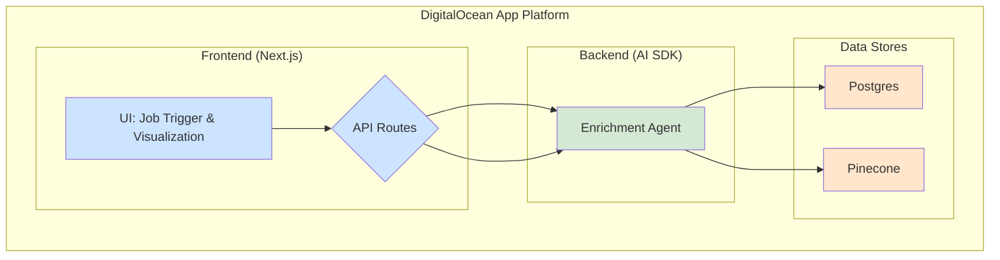
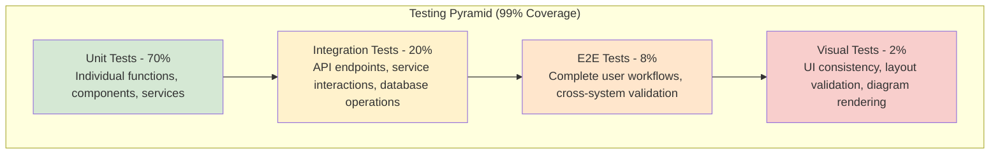

# Resilion Enrichment Pre-Loader POC: Engineering Development Plan

*Generated: 2025-06-28*  
*Last Updated: 2025-06-29*

---

## 1. High-Level Architecture Summary

The system will be a monorepo application composed of three main components:

*   **Next.js Frontend:** A web interface for triggering enrichment jobs, visualizing the workflow status via a Mermaid.js diagram, and reviewing the extracted data. It will communicate with the backend via API calls.
*   **AI SDK Backend (TypeScript/Node.js):** The core orchestration layer responsible for managing the enrichment workflow. It will handle job initialization, execute the multi-step enrichment chain (crawling, chunking, embedding, extraction, scoring), and persist results. It will expose API endpoints for the frontend.
*   **Data Stores:**
    *   **DigitalOcean Managed Postgres:** To store structured data, including enrichment job statuses, extracted facts (in JSONB format), and error logs.
    *   **Pinecone:** To store vector embeddings of the evidence text chunks for semantic search and retrieval.

The entire application will be deployed on the **DigitalOcean App Platform**, leveraging its integrated CI/CD capabilities.

---

## 2. Technology Stack Confirmation

The technology stack is confirmed as follows, aligning with the project's goals of rapid development, maintainability, and future scalability.

*   **Orchestration:** AI SDK (TypeScript)
*   **Frontend:** Next.js (React)
*   **Styling:** TailwindCSS + shadcn/ui component library
*   **Backend API:** Native Next.js API routes or standalone Node.js service
*   **Primary Database:** DigitalOcean Managed Postgres
*   **Vector Store:** Pinecone
*   **Workflow Visualization:** Mermaid.js
*   **Deployment:** DigitalOcean App Platform
*   **Optional Microservice:** FastAPI (Python) - To be considered for future Python-based NLP tasks.

---

## 2.5. Git Workflow and Best Practices

All development will follow git best practices with frequent commits and proper branching:

### Branch Strategy
*   **main:** Production-ready code only
*   **feature/[milestone-name]:** Feature branches for each milestone
*   **feature/[ticket-number]-[description]:** Individual ticket branches for larger features

### Commit Standards
*   **Conventional Commits:** Use format `type(scope): description`
*   **Types:** feat, fix, docs, style, refactor, test, chore
*   **Frequency:** Commit after each logical unit of work (minimum daily)
*   **Messages:** Clear, descriptive commit messages explaining the "what" and "why"

### Pull Request Process
*   All feature branches must be reviewed via Pull Request before merging to main
*   Include tests and documentation updates in PRs
*   Squash commits when merging to maintain clean history

## 3. Sequence of Development Milestones

The development will proceed in the following milestones:

### Milestone 1: Foundation & Setup (1-2 days)
*   Initialize proper monorepo structure using shadcn/ui CLI with `apps/web` and `packages/ui` workspaces.
*   Configure Turborepo for build orchestration and workspace management.
*   Set up DigitalOcean Postgres and Pinecone instances.
*   Define database schema and create initial migration scripts (for `enrichment_jobs` and `enrichment_facts` tables).
*   Establish environment variable management for API keys and database connections.
*   Implement dark mode support using next-themes provider.
*   **Task Management:** Update milestone status to `Complete` in project tracking.
*   **Git:** Create feature branch, commit each setup step, push and create PR for milestone completion.

**Testing & Validation (99% Coverage Target):**
*   **Unit Tests (Vitest Setup):**
    *   Configure Vitest with coverage reporting (Istanbul/c8)
    *   Test database connection utilities and environment variable validation
    *   Test schema validation functions and migration scripts
    *   Coverage target: 100% for utility functions and configuration modules
*   **Integration Tests:**
    *   Database connection and migration execution tests
    *   Environment variable loading and validation tests
    *   Turborepo workspace configuration validation
*   **CI/CD Pipeline Setup:**
    *   Configure GitHub Actions with coverage reporting
    *   Set up coverage threshold enforcement (99% minimum)
    *   Integrate Playwright for future visual testing setup
*   **Documentation Tests:**
    *   Validate all environment variables are documented
    *   Test setup instructions with clean environment simulation

### Milestone 2: Backend Core Logic (3-5 days)
*   Implement the core `EnrichmentAgent` service.
*   Develop the job initialization logic (API endpoint to accept a domain).
*   Build the first two steps of the chain: web crawling and text chunking.
*   Integrate with Pinecone to store text chunks and embeddings.
*   **Task Management:** Update milestone status to `Complete` in project tracking.
*   **Git:** Work in feature/backend-core branch, commit after each service implementation, create PR for review.

**Testing & Validation (99% Coverage Target):**
*   **Unit Tests (Vitest):**
    *   `WebCrawlerService`: Test with various HTML structures, robots.txt compliance, error handling for unreachable domains
    *   `TextChunkingService`: Test chunking algorithms with different text sizes, overlap calculations, edge cases (empty text, very short text)
    *   `EmbeddingService`: Mock OpenAI API calls, test batch processing, error handling for API failures
    *   `EnrichmentChain`: Test step execution order, context passing, error propagation, rollback mechanisms
    *   Coverage target: 100% for all service methods and error paths
*   **Integration Tests:**
    *   API endpoint `/api/enrichment`: Test domain validation, job creation, idempotency, error responses
    *   Database operations: Test job persistence, status updates, transaction rollbacks
    *   Pinecone integration: Test vector upserts, metadata storage, index creation
    *   Chain execution: Test full crawl → chunk → embed workflow with mock data
*   **E2E Tests (Manual for now):**
    *   Trigger enrichment for a controlled test domain (local HTML file)
    *   Verify job status transitions: pending → running → completed
    *   Confirm chunks are stored in Pinecone with correct metadata
    *   Validate database records match expected job progression
*   **Performance Tests:**
    *   Test chunking performance with large text documents (>100KB)
    *   Test concurrent job handling (5 simultaneous jobs)
    *   Measure embedding generation throughput and API rate limiting

### Milestone 3: AI-Powered Extraction (3-4 days)
*   Develop and version the prompt template for entity extraction.
*   Integrate the AI SDK to call the LLM for extraction.
*   Implement JSON schema validation on the LLM output.
*   Implement the confidence scoring and data persistence steps in the chain.
*   **Task Management:** Update milestone status to `Complete` in project tracking.
*   **Git:** Use feature/ai-extraction branch, commit prompt changes and AI integration separately, create PR.

**Testing & Validation (99% Coverage Target):**
*   **Unit Tests (Vitest):**
    *   `PromptTemplate`: Test prompt generation with various input contexts, parameter substitution, versioning
    *   `LLMService`: Mock AI SDK calls, test response parsing, error handling for API failures, rate limiting
    *   `JSONSchemaValidator`: Test schema validation with valid/invalid LLM outputs, edge cases, malformed JSON
    *   `ConfidenceScorer`: Test scoring algorithms with various fact types, confidence thresholds, statistical accuracy
    *   `ExtractionStep`: Test full extraction workflow, error recovery, data transformation
    *   Coverage target: 100% for all AI integration and validation logic
*   **Integration Tests:**
    *   End-to-end extraction chain: crawled text → chunks → embeddings → facts
    *   Database persistence: Test fact storage, confidence scores, source attribution
    *   Error handling: Test LLM failures, schema violations, confidence threshold filtering
    *   Prompt versioning: Test backward compatibility and prompt evolution
*   **Prompt Validation Tests:**
    *   Golden dataset testing: Known inputs with expected fact extractions
    *   Regression testing: Ensure prompt changes don't break existing functionality
    *   Edge case testing: Empty results, malformed company data, ambiguous information
    *   Performance testing: Measure extraction accuracy and processing time
*   **AI Quality Assurance:**
    *   Test with 10+ diverse company domains for extraction accuracy
    *   Validate confidence scores correlate with manual fact verification
    *   Test hallucination detection and filtering mechanisms

### Milestone 4: Frontend Implementation (4-6 days)
*   Initialize shadcn/ui component library and configure project settings.
*   Build the basic UI layout with Next.js, TailwindCSS, and shadcn/ui components.
*   Implement the job trigger panel using shadcn/ui Card, Input, and Button components.
*   Integrate Mermaid.js for the workflow visualization, driven by backend status polling using shadcn/ui Card layout.
*   Create the job status table and the fact viewer panel using shadcn/ui Table and Badge components.
*   **Task Management:** Update milestone status to `Complete` in project tracking.
*   **Git:** Work in feature/frontend-ui branch, commit each component implementation, create PR for review.

**Testing & Validation (99% Coverage Target):**
*   **Unit Tests (Vitest + React Testing Library):**
    *   Individual components: `JobTriggerPanel`, `StatusTable`, `FactViewer`, `WorkflowDiagram`
    *   Component props and state management, event handlers, conditional rendering
    *   Form validation, input sanitization, error state handling
    *   Mermaid.js integration: diagram generation, status updates, interactive elements
    *   Coverage target: 95% for React components (excluding trivial render-only components)
*   **Integration Tests:**
    *   Component interactions: form submission → status polling → results display
    *   API integration: mock backend responses, error handling, loading states
    *   Theme switching: dark/light mode consistency across all components
    *   Responsive behavior: mobile, tablet, desktop layout validation
*   **Visual Regression Tests (Playwright):**
    *   **Baseline Screenshots:**
        1. Dashboard in default state (empty, light theme)
        2. Dashboard with active job showing Mermaid workflow diagram
        3. Completed job with fact results table populated
        4. Error states: network failure, job failure, no results found
        5. Dark theme variations of all above states
        6. Mobile responsive layouts for all key screens
    *   **Cross-browser Testing:** Chrome, Firefox, Safari baseline validation
    *   **Interactive Element Testing:** Button hover states, form focus states, tooltip displays
    *   **Mermaid Diagram Testing:** Workflow visualization accuracy, step highlighting, progress indicators
*   **Accessibility Tests:**
    *   WCAG 2.1 AA compliance validation
    *   Keyboard navigation testing for all interactive elements
    *   Screen reader compatibility testing
    *   Color contrast validation for all text/background combinations
*   **Performance Tests:**
    *   Page load times, bundle size analysis, Core Web Vitals measurement
    *   Large dataset rendering: 100+ facts in results table
    *   Real-time polling performance and memory usage

### Milestone 5: Integration, Testing & Deployment (3-4 days)
*   End-to-end integration of frontend and backend.
*   Implement error handling and retry logic.
*   Write unit and integration tests for critical components (especially the agent chain and data validation).
*   Deploy to DigitalOcean App Platform and conduct a full test with a pilot customer domain.
*   **Task Management:** Update milestone status to `Complete` in project tracking.
*   **Git:** Use feature/integration-testing branch, commit test implementations and deployment configs, create final PR.

**Testing & Validation (99% Coverage Target):**
*   **End-to-End Tests (Playwright):**
    *   **Complete User Journeys:**
        1. Navigate to app → Enter domain → Trigger enrichment → Monitor progress → View results
        2. Error recovery: Handle network failures, API timeouts, invalid domains
        3. Concurrent jobs: Multiple users triggering jobs simultaneously
        4. Job history: View previous jobs, retry failed jobs, cancel running jobs
    *   **Cross-system Validation:**
        1. Frontend → API → Database → Pinecone → LLM integration
        2. Real-time status updates and progress tracking
        3. Data consistency across all storage systems
*   **Load Testing:**
    *   Concurrent user simulation: 10+ simultaneous enrichment jobs
    *   Database connection pooling and transaction handling under load
    *   API rate limiting and throttling validation
    *   Memory usage and resource cleanup verification
*   **Security Testing:**
    *   Input validation and sanitization across all endpoints
    *   SQL injection prevention, XSS protection
    *   API authentication and authorization (if implemented)
    *   Environment variable security and secret management
*   **Deployment Validation:**
    *   DigitalOcean App Platform deployment pipeline testing
    *   Environment variable configuration validation
    *   Database migration execution in production environment
    *   Health checks and monitoring setup validation
*   **Production Readiness:**
    *   Error logging and monitoring setup
    *   Performance monitoring and alerting
    *   Backup and recovery procedures testing
    *   Documentation completeness and accuracy validation
*   **Final Coverage Validation:**
    *   Comprehensive coverage report generation
    *   99% coverage threshold enforcement
    *   Coverage gap analysis and remediation
    *   Test suite performance and reliability validation

---

## 4. Suggested Backlog with Prioritized Engineering Tickets

### Priority 1: Must-Have

*   **Ticket-101:** [Setup] Initialize Git monorepo and configure basic CI/CD with DigitalOcean. **Task Management:** Update ticket status to `Complete`. **Git:** Commit setup configs, push feature branch, create PR.
*   **Ticket-102:** [DB] Define and apply Postgres schema for `enrichment_jobs` and `facts`. **Task Management:** Update ticket status to `Complete`. **Git:** Commit schema files and migrations, push changes.
*   **Ticket-103:** [Backend] Create API endpoint to trigger a new enrichment job. **Task Management:** Update ticket status to `Complete`. **Git:** Commit API route implementation, push to feature branch.
*   **Ticket-104:** [Agent] Implement web crawler to fetch content from a given domain. **Task Management:** Update ticket status to `Complete`. **Git:** Commit crawler service, push changes with tests.
*   **Ticket-105:** [Agent] Implement text chunking and embedding with Pinecone integration. **Task Management:** Update ticket status to `Complete`. **Git:** Commit chunking logic and Pinecone integration, push changes.
*   **Ticket-106:** [Agent] Implement AI SDK-based entity extraction using the prompt template. **Task Management:** Update ticket status to `Complete`. **Git:** Commit prompt template and AI integration, push changes.
*   **Ticket-107:** [Agent] Implement data persistence to Postgres. **Task Management:** Update ticket status to `Complete`. **Git:** Commit repository pattern implementation, push changes.
*   **Ticket-108:** [Frontend] Build UI for triggering enrichment jobs using shadcn/ui Card, Input, and Button components. **Task Management:** Update ticket status to `Complete`. **Git:** Commit UI components, push to feature branch.
*   **Ticket-109:** [Frontend] Implement Mermaid.js visualization with status polling using shadcn/ui Card layout. **Task Management:** Update ticket status to `Complete`. **Git:** Commit visualization components, push changes.
*   **Ticket-110:** [Frontend] Display extracted facts and confidence scores using shadcn/ui Table and Badge components. **Task Management:** Update ticket status to `Complete`. **Git:** Commit fact display components, push final changes.

### Priority 2: Should-Have

*   **Ticket-201:** [Backend] Implement robust error logging for failed enrichment steps. **Task Management:** Update ticket status to `Complete`. **Git:** Commit error handling improvements, push changes.
*   **Ticket-202:** [Backend] Add support for manual job retries. **Task Management:** Update ticket status to `Complete`. **Git:** Commit retry logic implementation, push changes.
*   **Ticket-203:** [Testing] Write unit tests for the extraction and validation logic. **Task Management:** Update ticket status to `Complete`. **Git:** Commit test suites, push changes with CI updates.
*   **Ticket-204:** [Docs] Document environment variables and setup instructions in `README.md`. **Task Management:** Update ticket status to `Complete`. **Git:** Commit documentation updates, push changes.
*   **Ticket-205:** [Testing] Configure Vitest with 99% coverage enforcement and CI integration. **Task Management:** Update ticket status to `Complete`. **Git:** Commit test configuration and CI pipeline setup.
*   **Ticket-206:** [Testing] Implement comprehensive unit tests for all service classes. **Task Management:** Update ticket status to `Complete`. **Git:** Commit service test suites with 100% coverage.
*   **Ticket-207:** [Testing] Create integration tests for API endpoints and database operations. **Task Management:** Update ticket status to `Complete`. **Git:** Commit integration test suites.
*   **Ticket-208:** [Testing] Set up Playwright for visual regression testing with baseline screenshots. **Task Management:** Update ticket status to `Complete`. **Git:** Commit Playwright configuration and initial visual tests.

### Priority 3: Nice-to-Have

*   **Ticket-301:** [Frontend] Add color-coding to the fact viewer based on confidence scores. **Task Management:** Update ticket status to `Complete`. **Git:** Commit UI enhancements, push changes.
*   **Ticket-302:** [Testing] Create a suite of prompt validation tests. **Task Management:** Update ticket status to `Complete`. **Git:** Commit prompt test suite, push final changes.
*   **Ticket-303:** [Testing] Implement accessibility testing with WCAG 2.1 AA compliance validation. **Task Management:** Update ticket status to `Complete`. **Git:** Commit accessibility test suite.
*   **Ticket-304:** [Testing] Create performance testing suite for load and stress testing. **Task Management:** Update ticket status to `Complete`. **Git:** Commit performance test configurations.
*   **Ticket-305:** [Testing] Implement cross-browser visual testing for Chrome, Firefox, and Safari. **Task Management:** Update ticket status to `Complete`. **Git:** Commit cross-browser test configurations.
*   **Ticket-306:** [Testing] Create security testing suite for input validation and XSS prevention. **Task Management:** Update ticket status to `Complete`. **Git:** Commit security test implementations.
*   **Ticket-307:** [Testing] Implement E2E test suite covering complete user journeys. **Task Management:** Update ticket status to `Complete`. **Git:** Commit comprehensive E2E test scenarios.
*   **Ticket-308:** [Testing] Create test data management system with fixtures and mocks. **Task Management:** Update ticket status to `Complete`. **Git:** Commit test data infrastructure.

---

## 5. Recommended Reusable Code Patterns or Frameworks

*   **Chain-of-Responsibility Pattern:** For the enrichment agent, where each step (`crawl`, `embed`, `extract`, etc.) is a handler in the chain. This makes the workflow modular and extensible.
*   **Repository Pattern:** To abstract data access, creating a clear separation between business logic and data persistence (e.g., `PostgresRepository`, `PineconeRepository`).
*   **Typed Interfaces:** Use TypeScript interfaces (e.g., `IEnrichmentFact`) that mirror the JSON schema to ensure type safety throughout the application.
*   **Prompt Registry:** Store and manage prompts in a dedicated `prompts/` directory, versioning them like code.

---

## 6. Testing and Validation Approach (99% Coverage Target)

Our testing strategy aims for **99% code coverage** with comprehensive automated testing at all levels, including visual regression testing to ensure UI consistency.

### Testing Stack
*   **Unit & Integration Testing:** Vitest with Istanbul coverage reporting
*   **Visual Regression Testing:** Playwright with screenshot comparison
*   **E2E Testing:** Playwright for full user journey validation
*   **Coverage Enforcement:** CI/CD pipeline configured to fail builds below 99% coverage threshold

### Testing Pyramid Structure

### Coverage Requirements by Component
*   **Services (crawler, chunker, embeddings, agent):** 100% coverage of all methods and error paths
*   **API Routes:** 100% coverage including error handling and validation
*   **React Components:** 95% coverage (excluding trivial render-only components)
*   **Utility Functions:** 100% coverage of all branches and edge cases
*   **Database Operations:** 100% coverage including transaction rollbacks

### Visual Regression Testing Strategy
*   **Baseline Management:** Golden screenshots stored in version control
*   **Automated Comparison:** Pixel-perfect diff detection with configurable thresholds
*   **Cross-browser Testing:** Chrome, Firefox, and Safari baseline validation
*   **Responsive Testing:** Mobile, tablet, and desktop viewport validation
*   **Component Isolation:** Individual component visual testing in Storybook-style isolation

### Test Data Management
*   **Mock Data:** Comprehensive test fixtures for all data models
*   **Test Databases:** Isolated test database instances with seed data
*   **API Mocking:** Mock external services (OpenAI, Pinecone) for reliable testing
*   **Snapshot Testing:** JSON schema validation and response structure testing

---

## 7. Deployment Plan and Environment Variables

### Deployment
*   **Platform:** The application will be deployed as a single monorepo to the DigitalOcean App Platform. The `app.yaml` (or equivalent configuration) will define the build and run commands for the Next.js service.
*   **CI/CD:** Deployment will be triggered automatically on pushes to the `main` branch via GitHub integration.

### Environment Variables
All secrets and configurations will be managed through the DigitalOcean App Platform's environment variable settings:

*   `DATABASE_URL`: Connection string for Postgres.
*   `PINECONE_API_KEY`: API key for Pinecone.
*   `PINECONE_ENVIRONMENT`: Pinecone environment name.
*   `OPENAI_API_KEY` (or equivalent LLM provider key).
*   `LOG_LEVEL`: To control application log verbosity (e.g., `info`, `debug`).

---

## 8. Known Risks or Dependencies

*   **Data Sparsity:** Public data for certain domains may be sparse or inaccurate, impacting the confidence of extracted facts.
*   **LLM Reliability:** LLM hallucinations or schema violations are a risk. This will be mitigated by strong prompt engineering, schema validation, and retry logic.
*   **Third-Party API Limits:** Rate limits on the LLM provider or other data sources could slow down enrichment.
*   **Scope Creep:** The POC must strictly adhere to the defined scope, avoiding the temptation to add complex features like advanced visualization or user management.

---

## 9. Assumptions

*   The AI SDK and other core libraries will be sufficient for the POC's needs without requiring significant custom workarounds.
*   The DigitalOcean App Platform will support the necessary build processes and runtime environment.
*   Access to the required API keys (LLM, Pinecone) will be available at the start of development.
*   The initial set of public data sources (corporate websites, press releases) will be sufficient to meet the 80% confidence success criteria for the pilot.

---

## 10. Additional Recommendations for Plan Enhancement

### Critical Gaps & Missing Considerations

*   **Gap: Data Source Resiliency.**
    *   **Observation:** The current plan relies heavily on crawling corporate websites, which can be brittle.
    *   **Recommendation:** Add at least one structured public data source API (e.g., a free-tier business directory or an open government database) to the agent's toolset. This will test the system's ability to merge data from both unstructured (crawled) and structured (API) sources, providing a more realistic validation.

*   **Gap: Ethical and Robust Crawling Strategy.**
    *   **Observation:** The plan mentions "crawling" but lacks specifics. A naive implementation can lead to being IP-blocked or inefficiently parsing JavaScript-heavy sites.
    *   **Recommendation:**
        1.  Implement a check for `robots.txt` before crawling any domain.
        2.  Use a headless browser (e.g., Puppeteer) for the crawling step to handle dynamic content rendering.
        3.  Introduce a configurable delay between requests to avoid overwhelming the target server.

### Strengthening Technical Resilience

*   **Resilience: Job Idempotency.**
    *   **Observation:** A user could accidentally trigger the same enrichment job multiple times.
    *   **Recommendation:** Make the job creation endpoint idempotent. Before creating a new job, the API should check if an active or recently completed job for the same domain exists. If so, it should return the status of the existing job instead of creating a new one.

*   **Resilience: Dead-Letter Queue for Failed Jobs.**
    *   **Observation:** Simply logging errors can make re-processing failed jobs difficult.
    *   **Recommendation:** Implement a simple "Dead-Letter Queue" pattern. Create a `failed_jobs` table in Postgres. When an enrichment step fails irrecoverably, the agent should write the job payload and error details to this table. This isolates failures for later inspection and manual replay.

### Additional Tests & Hardening Tasks

*   **Hardening: Input Sanitization.**
    *   **Observation:** The domain input field is a potential, albeit low-risk, attack vector.
    *   **Recommendation:** Add basic input validation and sanitization on the backend API to prevent any malicious scripts or malformed data from entering the system.

*   **Testing: Concurrent Job Simulation.**
    *   **Observation:** The system's behavior under parallel load is unknown.
    *   **Recommendation:** Before final validation, create a simple test script to trigger 5-10 enrichment jobs concurrently. This will help identify any immediate race conditions or resource contention issues.

*   **Testing: Graceful Handling of "No Results".**
    *   **Observation:** A successful run might yield zero valid facts.
    *   **Recommendation:** Add an explicit E2E test case for a domain known to have no manufacturing sites. Ensure the UI displays a clear "No facts found" message instead of showing an error or an empty, broken state.

---

## Next Steps

1. Review and approve this development plan
2. Set up development environment and external services (Postgres, Pinecone)
3. Begin Milestone 1: Foundation & Setup
4. Execute tickets in priority order
5. Conduct regular milestone reviews and plan adjustments as needed

---

*This plan serves as the primary reference document for the Resilion Enrichment Pre-Loader POC development effort.*
