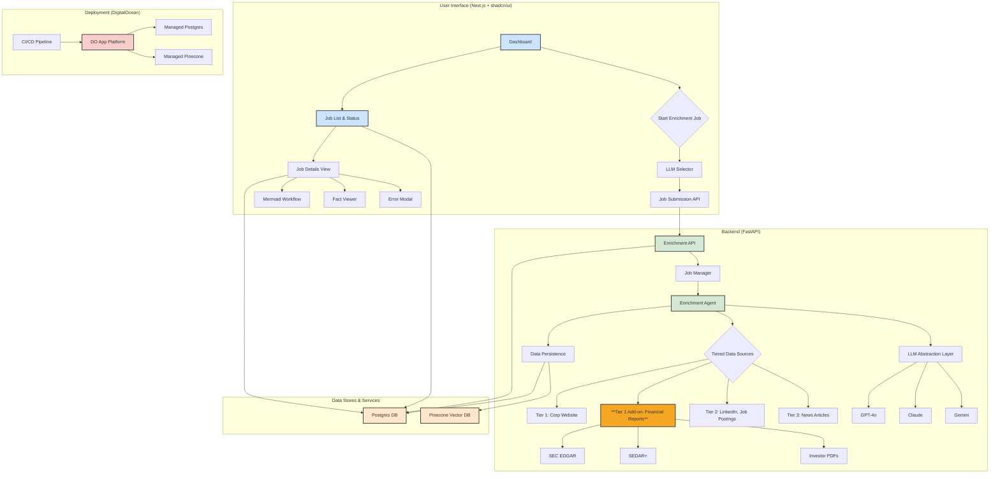

# Resilion Enrichment Framework - Revised Development Plan

This document outlines the milestones, deliverables, and timeline for evolving the Resilion Enrichment POC into a production-grade framework.

### **High-Level Architecture (Updated)**

The architecture is updated to include a specialized financial document parsing service within the backend.

---

### **Milestone 1: Core Backend Refactoring & LLM Integration**

**Goal:** Rearchitect the backend to support the expanded data model, multi-pass enrichment, and user-selectable LLMs.

**Timeline:** 2 weeks

**Deliverable Feature Sets:**

1.  **Database Schema Extension:** ✅ **COMPLETED**
    *   ✅ Modified the `enrichment_jobs` table to include `llm_used` (VARCHAR(50)), updated `status` enum to include `partial_success`, and added columns for job-level metrics (`pages_scraped`, `total_runtime_seconds`).
    *   ✅ Modified the `enrichment_facts` table to include `tier_used` (INTEGER with CHECK constraint 1-3).
    *   ✅ Created and applied database migration scripts successfully to production database.
    *   ✅ Added performance indexes on `llm_used` and `tier_used` fields.
    *   ✅ Updated TypeScript interfaces and repository classes to support new schema.
2.  **LLM Abstraction Layer:** ⏳ **PENDING**
    *   Create a service layer that abstracts interactions with different LLM providers (OpenAI, Anthropic, Google).
    *   Implement provider-specific clients for GPT-4o, Claude 3 Opus, and Gemini 1.5 Pro.
    *   Use a factory pattern or similar to instantiate the selected LLM client for a given job.
3.  **Tiered Data Source Framework:** ⏳ **PENDING**
    *   Refactor the `enrichment-agent` to support a sequence of enrichment "passes".
    *   Implement crawler/scraper modules for each data source tier, respecting depth limits (e.g., 5 pages for corporate sites).

**Acceptance Criteria:**

*   ✅ **COMPLETED** - Database migration scripts are created and successfully applied. The `enrichment_jobs` and `enrichment_facts` tables reflect the new schema.
*   ⏳ An API endpoint exists to initiate an enrichment job, accepting a `domain` and `llm_choice` parameter.
*   ✅ **COMPLETED** - The selected `llm_used` is correctly recorded in the `enrichment_jobs` table (database schema supports this).
*   ⏳ The enrichment agent can execute a single pass using a specified Tier 1 data source.
*   ⏳ Unit tests cover the LLM abstraction layer, ensuring each provider can be invoked.

**Task Management:**
*   ✅ Update milestone status to `Complete` for Database Schema Extension in project tracking.
*   ⏳ Update milestone status to `Complete` for LLM Abstraction Layer upon completion.
*   ⏳ Update milestone status to `Complete` for Tiered Data Source Framework upon completion.

**Git:**
*   ✅ Created feature/milestone-1-schema-extension branch for database work.
*   ✅ Committed schema extensions, repository updates, and testing separately.
*   ✅ Pushed changes and created PR for milestone completion review.
*   ⏳ Create feature/milestone-1-llm-integration branch for LLM abstraction work.
*   ⏳ Create feature/milestone-1-tiered-framework branch for tiered enrichment work.

**Risk Areas:**

*   **API Quotas & Costs:** Different LLMs have varying costs and rate limits. This needs to be monitored.
*   **Scraping Complexity:** Websites may have anti-bot measures, requiring robust scraping solutions (e.g., using headless browsers or specialized services).

---

### **Milestone 2: Financial Report Parsing Engine**

**Goal:** Develop a specialized service to download, parse, and extract structured site data from public financial reports.

**Timeline:** 2.5 weeks

**Deliverable Feature Sets:**

1.  **Financial Document Retriever:**
    *   Implement modules to fetch the most recent annual reports from primary sources:
        *   SEC EDGAR (10-K filings).
        *   Corporate Investor Relations websites (for PDF reports).
        *   (Future extension) SEDAR+ and Companies House.
    *   Limit retrieval to the single most recent annual report per job.
2.  **Document Parser & Section Extractor:**
    *   Implement a robust parsing service that can handle HTML (from EDGAR) and PDF formats.
    *   Develop logic to identify and extract the raw text from key sections: "Properties," "Business Segment," "Management Discussion and Analysis," and "Risk Factors."
3.  **Structured Data Extraction from Filings:**
    *   Design a specific LLM prompt chain optimized for extracting structured site data (facility names, addresses, site type, capacity, etc.) from the dense, legalistic text of the targeted sections.

**Acceptance Criteria:**

*   ✅ The system can successfully download the latest 10-K filing for a given US public company.
*   ✅ The system can parse a sample PDF annual report and extract its text content.
*   ✅ The text from the "Properties" and "Business Segment" sections can be successfully isolated from a downloaded report.
*   ✅ Given the text from a relevant section, the LLM can extract at least 3 structured data points (e.g., facility name, address, site type) with supporting evidence.
*   ✅ Extracted financial data is correctly persisted in the `enrichment_facts` table, with the source URL pointing to the filing.
*   ✅ If a financial report cannot be found for a company, the pass is gracefully skipped, logged, and the agent proceeds to the next tier.

**Task Management:**
*   Update milestone status to `Complete` for Financial Document Retriever upon completion.
*   Update milestone status to `Complete` for Document Parser & Section Extractor upon completion.
*   Update milestone status to `Complete` for Structured Data Extraction from Filings upon completion.

**Git:**
*   Create feature/milestone-2-financial-retriever branch for document retrieval work.
*   Create feature/milestone-2-document-parser branch for parsing engine work.
*   Create feature/milestone-2-data-extraction branch for LLM extraction work.
*   Commit each component implementation separately with comprehensive tests.
*   Push changes and create PR for milestone completion review.

**Risk Areas:**

*   **Document Format Complexity:** Financial reports come in various formats (XBRL, iXBRL, PDF, HTML). Parsing them reliably is a major technical challenge. We may need to license a third-party API (e.g., SEC-API.io) to de-risk this and ensure reliability.
*   **LLM Accuracy:** Extracting structured data from dense text is prone to error and hallucination. Prompts will require significant engineering and validation.
*   **Source Availability:** Not all companies will have easily accessible, machine-readable reports, which may limit the effectiveness of this pass.

---

### **Milestone 3: Advanced Enrichment Logic & Job Management**

**Goal:** Implement the sophisticated chaining, timeout, and retry logic required for a production-grade system.

**Timeline:** 2 weeks

**Deliverable Feature Sets:**

1.  **Enrichment Chaining Engine:**
    *   Implement logic to proceed through Tiers 1, 2, and 3 sequentially.
    *   Use a default confidence threshold of **0.7** to determine if a pass is successful and the chain can be halted.
    *   Enforce a maximum number of passes to prevent runaway jobs.
2.  **Tier 3 News Sourcing:**
    *   Implement a client for the **Bing News Search API** to source up to 5 relevant news articles for Tier 3 enrichment.
2.  **Job Lifecycle Management:**
    *   Implement strict 30-minute job timeouts using a background task manager (e.g., Celery, ARQ, or FastAPI's `BackgroundTasks`).
    *   Implement retry logic (max 3 attempts) for failed jobs, with exponential backoff.
    *   Update the job `status` (`pending`, `running`, `completed`, `partial_success`, `failed`) accurately throughout the lifecycle.
3.  **Evidence & Confidence:**
    *   Ensure every extracted fact is stored with its evidence snippet, source URL, confidence score, and the tier it was found in.

**Acceptance Criteria:**

*   ✅ An enrichment job correctly moves from Tier 1 to Tier 2 if the confidence threshold is not met.
*   ✅ A job stops after a tier if the confidence threshold is satisfied.
*   ✅ A job that runs for over 30 minutes is marked as `failed` and its resources are cleaned up.
*   ✅ A failed job is automatically retried up to 3 times.
*   ✅ All facts in the `enrichment_facts` table have non-null `source_text`, `source_url`, `confidence_score`, and `tier_used` fields.
*   ✅ The `partial_success` status is correctly applied if a job completes some tiers but fails on a later one.

**Task Management:**
*   Update milestone status to `Complete` for Enrichment Chaining Engine upon completion.
*   Update milestone status to `Complete` for Tier 3 News Sourcing upon completion.
*   Update milestone status to `Complete` for Job Lifecycle Management upon completion.
*   Update milestone status to `Complete` for Evidence & Confidence upon completion.

**Git:**
*   Create feature/milestone-3-chaining-engine branch for enrichment chaining work.
*   Create feature/milestone-3-news-sourcing branch for Tier 3 news integration.
*   Create feature/milestone-3-job-lifecycle branch for timeout and retry logic.
*   Create feature/milestone-3-evidence-confidence branch for evidence tracking.
*   Commit each component implementation separately with comprehensive tests.
*   Push changes and create PR for milestone completion review.

**Risk Areas:**

*   **State Management:** Managing the state of long-running, multi-pass jobs can be complex. The database must be the single source of truth.
*   **Confidence Scoring:** Defining and calculating a reliable confidence score is challenging and will require iteration.

---

### **Milestone 4: Frontend Scaffolding & Core UI**

**Goal:** Build the foundational Next.js application and the user interface for initiating and tracking enrichment jobs.

**Timeline:** 1.5 weeks

**Deliverable Feature Sets:**

1.  **Next.js 14 App Setup:**
    *   Initialize a new Next.js 14 project using the App Router.
    *   Integrate `shadcn/ui` and configure the theme.
    *   Set up a basic layout with navigation.
2.  **Enrichment Initiation UI:**
    *   Create a form to submit a new enrichment job (input for domain).
    *   Add a `Select` component (from shadcn/ui) for the user to choose the LLM.
3.  **Job Dashboard:**
    *   Create a page that lists all enrichment jobs, polling a backend API for updates.
    *   Display key information: domain, status (with a colored badge), LLM used, and timestamps.
    *   The list should be sortable and filterable.

**Acceptance Criteria:**

*   ✅ The Next.js application is running and serves a basic homepage.
*   ✅ Users can submit a new enrichment job via the UI, and the request is successfully sent to the backend API.
*   ✅ The LLM selector is populated with the available models (GPT-4o, Claude, Gemini).
*   ✅ The jobs dashboard displays a list of jobs from the database.
*   ✅ The job status on the dashboard updates automatically (e.g., every 5 seconds).

**Task Management:**
*   Update milestone status to `Complete` for Next.js 14 App Setup upon completion.
*   Update milestone status to `Complete` for Enrichment Initiation UI upon completion.
*   Update milestone status to `Complete` for Job Dashboard upon completion.

**Git:**
*   Create feature/milestone-4-nextjs-setup branch for Next.js application setup.
*   Create feature/milestone-4-initiation-ui branch for job submission UI.
*   Create feature/milestone-4-job-dashboard branch for dashboard implementation.
*   Commit each UI component implementation separately with tests.
*   Push changes and create PR for milestone completion review.

**Risk Areas:**

*   **UI/UX Design:** The initial UI will be functional but may require refinement based on user feedback.
*   **State Management:** Managing client-side state for real-time updates can be tricky. A library like SWR or React Query is recommended.

---

### **Milestone 5: Frontend Visualization & Data Display**

**Goal:** Create a rich user experience for inspecting job progress and viewing enrichment results.

**Timeline:** 1.5 weeks

**Deliverable Feature Sets:**

1.  **Job Detail View:**
    *   Create a dynamic page for a single enrichment job.
    *   Integrate the `Mermaid` library to visualize the enrichment workflow (Tiers 1-3) and color-code nodes based on their status: **green (completed)**, **blue (running)**, **gray (pending)**, and **red (failed)**.
2.  **Fact Viewer:**
    *   Display the extracted facts in a structured format (e.g., using `Card` and `Accordion` components from shadcn/ui).
    *   For each fact, show the JSON data, evidence snippet, source URL (as a clickable link), confidence score, and tier.
3.  **Error Handling UI:**
    *   When a job fails, display an error icon.
    *   Clicking the icon opens a `Dialog` (modal) component from shadcn/ui, showing the detailed `error_message` from the job record.

**Acceptance Criteria:**

*   ✅ The Mermaid diagram on the job detail page accurately reflects the real-time status of the enrichment passes.
*   ✅ All extracted facts for a job are displayed, with their associated evidence and metadata.
*   ✅ Clicking a failed job's error indicator opens a modal with a clear error message.
*   ✅ The UI is responsive and works well on different screen sizes.

**Task Management:**
*   Update milestone status to `Complete` for Job Detail View upon completion.
*   Update milestone status to `Complete` for Fact Viewer upon completion.
*   Update milestone status to `Complete` for Error Handling UI upon completion.

**Git:**
*   Create feature/milestone-5-job-detail-view branch for job detail page implementation.
*   Create feature/milestone-5-fact-viewer branch for fact display components.
*   Create feature/milestone-5-error-handling branch for error UI implementation.
*   Commit each visualization component separately with comprehensive tests.
*   Push changes and create PR for milestone completion review.

**Risk Areas:**

*   **Mermaid Integration:** Ensuring the Mermaid diagram updates dynamically and accurately with job progress requires careful client-server communication.

---

### **Milestone 6: CI/CD, Deployment & Documentation**

**Goal:** Automate the deployment process and provide comprehensive documentation for developers and operators.

**Timeline:** 1 week

**Deliverable Feature Sets:**

1.  **CI/CD Pipeline:**
    *   Create a GitHub Actions (or similar) workflow to run tests, linting, and builds on every push.
    *   Configure the pipeline to deploy to DigitalOcean App Platform on merges to the `main` branch.
2.  **DigitalOcean Configuration:**
    *   Write the `app.yaml` spec for the DigitalOcean App Platform.
    *   Ensure the app connects correctly to managed Postgres and Pinecone instances using environment variables.
3.  **Documentation:**
    *   Create a detailed `README.md` covering:
        *   Project architecture overview.
        *   Instructions for local development setup (`.env.example`).
        *   How to run the application.
        *   Documentation for all required environment variables.
4.  **Branching Strategy:**
    *   Formalize a branching strategy (e.g., GitFlow or a simpler feature-branch model) and document it.
    *   Use milestone branches (`milestone/1-backend-refactor`) to group features.
5.  **Test Coverage Strategy:**
    *   Implement comprehensive test coverage, including:
        *   Unit tests for each enrichment pass and data source parser.
        *   Integration tests for the LLM factory to ensure proper model selection.
        *   Mock tests for the financial parsing engine to handle various document structures without making live calls.

**Acceptance Criteria:**

*   ✅ Pushing to a feature branch automatically triggers the CI pipeline (tests, linting).
*   ✅ Merging to `main` automatically deploys the latest version to DigitalOcean.
*   ✅ The deployed application is live and fully functional.
*   ✅ The `README.md` provides clear, step-by-step instructions for a new developer to get the project running locally.
*   ✅ The branching strategy is documented and followed by the team.

**Task Management:**
*   Update milestone status to `Complete` for CI/CD Pipeline upon completion.
*   Update milestone status to `Complete` for DigitalOcean Configuration upon completion.
*   Update milestone status to `Complete` for Documentation upon completion.
*   Update milestone status to `Complete` for Branching Strategy upon completion.
*   Update milestone status to `Complete` for Test Coverage Strategy upon completion.

**Git:**
*   Create feature/milestone-6-cicd-pipeline branch for GitHub Actions workflow setup.
*   Create feature/milestone-6-do-config branch for DigitalOcean App Platform configuration.
*   Create feature/milestone-6-documentation branch for README and documentation work.
*   Create feature/milestone-6-branching-strategy branch for Git workflow documentation.
*   Create feature/milestone-6-test-coverage branch for comprehensive testing implementation.
*   Commit each deployment and documentation component separately.
*   Push changes and create final PR for milestone completion review.

**Risk Areas:**

*   **Environment Parity:** Ensuring the DigitalOcean environment perfectly mirrors the local development setup can be challenging.
*   **Secrets Management:** Securely managing API keys and database credentials in the CI/CD pipeline is critical.
