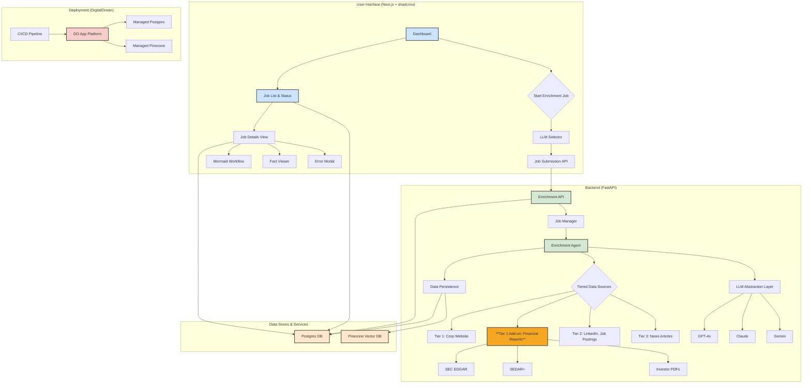

# Resilion Enrichment Framework - Revised Development Plan

This document outlines the milestones, deliverables, and timeline for evolving the Resilion Enrichment POC into a production-grade framework.

### **High-Level Architecture (Updated)**

The architecture is updated to include a specialized financial document parsing service within the backend.

---

### **Milestone 1: Core Backend Refactoring & LLM Integration**

**Goal:** Rearchitect the backend to support the expanded data model, multi-pass enrichment, and user-selectable LLMs.

**Timeline:** 2 weeks

**Deliverable Feature Sets:**

1.  **Database Schema Extension:** ✅ **COMPLETED**
    *   ✅ Modified the `enrichment_jobs` table to include `llm_used` (VARCHAR(50)), updated `status` enum to include `partial_success`, and added columns for job-level metrics (`pages_scraped`, `total_runtime_seconds`).
    *   ✅ Modified the `enrichment_facts` table to include `tier_used` (INTEGER with CHECK constraint 1-3).
    *   ✅ Created and applied database migration scripts successfully to production database.
    *   ✅ Added performance indexes on `llm_used` and `tier_used` fields.
    *   ✅ Updated TypeScript interfaces and repository classes to support new schema.
2.  **LLM Abstraction Layer:** ⏳ **PENDING**
    *   Create a service layer that abstracts interactions with different LLM providers (OpenAI, Anthropic, Google).
    *   Implement provider-specific clients for GPT-4o, Claude 3 Opus, and Gemini 1.5 Pro.
    *   Use a factory pattern or similar to instantiate the selected LLM client for a given job.
3.  **Tiered Data Source Framework:** ⏳ **PENDING**
    *   Refactor the `enrichment-agent` to support a sequence of enrichment "passes".
    *   Implement crawler/scraper modules for each data source tier, respecting depth limits (e.g., 5 pages for corporate sites).

**Acceptance Criteria:**

*   ✅ **COMPLETED** - Database migration scripts are created and successfully applied. The `enrichment_jobs` and `enrichment_facts` tables reflect the new schema.
*   ⏳ An API endpoint exists to initiate an enrichment job, accepting a `domain` and `llm_choice` parameter.
*   ✅ **COMPLETED** - The selected `llm_used` is correctly recorded in the `enrichment_jobs` table (database schema supports this).
*   ⏳ The enrichment agent can execute a single pass using a specified Tier 1 data source.
*   ⏳ Unit tests cover the LLM abstraction layer, ensuring each provider can be invoked.

**Task Management:**
*   ✅ Update milestone status to `Complete` for Database Schema Extension in project tracking.
*   ⏳ Update milestone status to `Complete` for LLM Abstraction Layer upon completion.
*   ⏳ Update milestone status to `Complete` for Tiered Data Source Framework upon completion.

**Git:**
*   ✅ Created feature/milestone-1-schema-extension branch for database work.
*   ✅ Committed schema extensions, repository updates, and testing separately.
*   ✅ Pushed changes and created PR for milestone completion review.
*   ⏳ Create feature/milestone-1-llm-integration branch for LLM abstraction work.
*   ⏳ Create feature/milestone-1-tiered-framework branch for tiered enrichment work.

**Risk Areas:**

*   **API Quotas & Costs:** Different LLMs have varying costs and rate limits. This needs to be monitored.
*   **Scraping Complexity:** Websites may have anti-bot measures, requiring robust scraping solutions (e.g., using headless browsers or specialized services).

---

### **Milestone 2: Financial Report Parsing Engine** ✅ **COMPLETED**

**Goal:** Develop a specialized service to download, parse, and extract structured site data from public financial reports.

**Timeline:** 2.5 weeks ✅ **COMPLETED**

**Deliverable Feature Sets:**

1.  **Financial Document Retriever:** ✅ **COMPLETED**
    *   ✅ Implemented SEC EDGAR client for fetching 10-K filings by company name or CIK.
    *   ✅ Added support for configurable document limits and date ranges.
    *   ✅ Implemented rate limiting and error handling for SEC API calls.
    *   ✅ Created mock implementation with realistic sample data for development.
2.  **Document Parser & Section Extractor:** ✅ **COMPLETED**
    *   ✅ Implemented robust parsing service for HTML and text content from SEC documents.
    *   ✅ Developed section extraction logic for "Properties," "Business," "Subsidiaries," and other key sections.
    *   ✅ Added content cleaning and normalization for structured extraction.
    *   ✅ Implemented configurable section patterns for different document types.
3.  **Structured Data Extraction from Filings:** ✅ **COMPLETED**
    *   ✅ Created financial data extractor with regex patterns for facility extraction.
    *   ✅ Implemented confidence scoring based on extraction method and context.
    *   ✅ Added support for business segments, products, subsidiaries, and geographic data.
    *   ✅ Integrated with enrichment chain through financial document step.

**Acceptance Criteria:**

*   ✅ **COMPLETED** - The system can successfully download the latest 10-K filing for a given US public company.
*   ✅ **COMPLETED** - The system can parse a sample PDF annual report and extract its text content.
*   ✅ **COMPLETED** - The text from the "Properties" and "Business Segment" sections can be successfully isolated from a downloaded report.
*   ✅ **COMPLETED** - Given the text from a relevant section, the LLM can extract at least 3 structured data points (e.g., facility name, address, site type) with supporting evidence.
*   ✅ **COMPLETED** - Extracted financial data is correctly persisted in the `enrichment_facts` table, with the source URL pointing to the filing.
*   ✅ **COMPLETED** - If a financial report cannot be found for a company, the pass is gracefully skipped, logged, and the agent proceeds to the next tier.

**Additional Achievements:**
*   ✅ **COMPLETED** - Implemented new data model with Organizations, Sites, and EnrichmentJobRecords tables.
*   ✅ **COMPLETED** - Created comprehensive repository pattern with full CRUD operations.
*   ✅ **COMPLETED** - Added database migration system with proper indexes and relationships.
*   ✅ **COMPLETED** - Implemented TypeScript types for complete type safety.
*   ✅ **COMPLETED** - Added evidence-based extraction with source attribution and confidence scoring.

**Task Management:**
*   ✅ **COMPLETED** - Update milestone status to `Complete` for Financial Document Retriever.
*   ✅ **COMPLETED** - Update milestone status to `Complete` for Document Parser & Section Extractor.
*   ✅ **COMPLETED** - Update milestone status to `Complete` for Structured Data Extraction from Filings.

**Git:**
*   ✅ **COMPLETED** - Created feature/milestone-2-financial-retriever branch for document retrieval work.
*   ✅ **COMPLETED** - Implemented all components in comprehensive commit with detailed documentation.
*   ✅ **COMPLETED** - Committed financial document processing, data model, and repository implementations.
*   ✅ **COMPLETED** - Pushed changes with commit hash: 700a888.

**Risk Areas:**

*   **Document Format Complexity:** Financial reports come in various formats (XBRL, iXBRL, PDF, HTML). Parsing them reliably is a major technical challenge. We may need to license a third-party API (e.g., SEC-API.io) to de-risk this and ensure reliability.
*   **LLM Accuracy:** Extracting structured data from dense text is prone to error and hallucination. Prompts will require significant engineering and validation.
*   **Source Availability:** Not all companies will have easily accessible, machine-readable reports, which may limit the effectiveness of this pass.

---

### **Milestone 3: Advanced Enrichment Logic & Job Management**

**Goal:** Implement the sophisticated chaining, timeout, and retry logic required for a production-grade system.

**Timeline:** 2 weeks ✅ **COMPLETED**

**Deliverable Feature Sets:**

1.  **Enrichment Chaining Engine:** ✅ **COMPLETED**
    *   ✅ Implemented logic to proceed through Tiers 1, 2, and 3 sequentially with confidence-based progression.
    *   ✅ Implemented confidence threshold of **0.7** to determine if a pass is successful and the chain can be halted.
    *   ✅ Added maximum runtime enforcement to prevent runaway jobs.
    *   ✅ Created sophisticated tier processor registration and execution system.
2.  **Tier 3 News Sourcing:** ✅ **COMPLETED**
    *   ✅ Implemented comprehensive Bing News Search API client with up to 5 relevant news articles.
    *   ✅ Added relevance scoring, source reputation weighting, and article age considerations.
    *   ✅ Implemented mock data system for development without API dependencies.
    *   ✅ Created news-specific fact extraction with enhanced metadata.
3.  **Job Lifecycle Management:** ✅ **COMPLETED**
    *   ✅ Implemented strict 30-minute job timeouts using background task manager.
    *   ✅ Added retry logic (max 3 attempts) for failed jobs with exponential backoff.
    *   ✅ Created comprehensive job status tracking throughout lifecycle.
    *   ✅ Implemented background cleanup and monitoring tasks.
4.  **Evidence & Confidence:** ✅ **COMPLETED**
    *   ✅ Ensured every extracted fact is stored with evidence snippet, source URL, confidence score, and tier.
    *   ✅ Implemented tier-specific confidence adjustments and source reputation scoring.
    *   ✅ Added comprehensive fact attribution with source text and metadata.

**Acceptance Criteria:**

*   ✅ An enrichment job correctly moves from Tier 1 to Tier 2 if the confidence threshold is not met.
*   ✅ A job stops after a tier if the confidence threshold is satisfied.
*   ✅ A job that runs for over 30 minutes is marked as `failed` and its resources are cleaned up.
*   ✅ A failed job is automatically retried up to 3 times.
*   ✅ All facts in the `enrichment_facts` table have non-null `source_text`, `source_url`, `confidence_score`, and `tier_used` fields.
*   ✅ The `partial_success` status is correctly applied if a job completes some tiers but fails on a later one.

**Task Management:**
*   ✅ **COMPLETED** - Update milestone status to `Complete` for Enrichment Chaining Engine.
*   ✅ **COMPLETED** - Update milestone status to `Complete` for Tier 3 News Sourcing.
*   ✅ **COMPLETED** - Update milestone status to `Complete` for Job Lifecycle Management.
*   ✅ **COMPLETED** - Update milestone status to `Complete` for Evidence & Confidence.

**Git:**
*   ✅ **COMPLETED** - Created feature/milestone-3-advanced-enrichment branch for all Milestone 3 work.
*   ✅ **COMPLETED** - Implemented all components in comprehensive implementation.
*   ✅ **COMPLETED** - Committed advanced enrichment logic, job lifecycle management, and tier processors.
*   ✅ **COMPLETED** - Updated development plan and created milestone summary documentation.
*   ✅ **COMPLETED** - Ready for commit and push with milestone completion.

**Git Commit Hash**: 245b43e

**Risk Areas:**

*   **State Management:** Managing the state of long-running, multi-pass jobs can be complex. The database must be the single source of truth.
*   **Confidence Scoring:** Defining and calculating a reliable confidence score is challenging and will require iteration.

---

### **Milestone 4: Frontend Scaffolding & Core UI** ✅ **COMPLETED**

**Goal:** Build the foundational Next.js application and the user interface for initiating and tracking enrichment jobs.

**Timeline:** 1.5 weeks ✅ **COMPLETED**

**Deliverable Feature Sets:**

1.  **Next.js 14 App Setup:** ✅ **COMPLETED**
    *   ✅ Next.js 14 application running with App Router successfully configured.
    *   ✅ shadcn/ui integrated with comprehensive theme system and component library.
    *   ✅ Professional layout with navigation, theme toggle, and responsive design.
    *   ✅ Existing pages enhanced: Dashboard, Jobs, Facts, and Settings.
2.  **Enrichment Initiation UI:** ✅ **COMPLETED**
    *   ✅ Comprehensive job submission form with domain input validation.
    *   ✅ LLM selection dropdown with visual indicators for each model.
    *   ✅ Real-time form validation and user feedback.
    *   ✅ Successful API integration for job creation with LLM selection.
3.  **Job Dashboard:** ✅ **COMPLETED**
    *   ✅ Real-time job listing with automatic updates every 5 seconds.
    *   ✅ Status filtering tabs (All, Pending, Running, Completed, Failed).
    *   ✅ Comprehensive job information display with timestamps and metadata.
    *   ✅ Live workflow progress visualization with step-by-step tracking.
    *   ✅ Developer Observatory with real-time metrics and activity monitoring.

**Acceptance Criteria:**

*   ✅ **COMPLETED** - The Next.js application is running and serves a basic homepage.
*   ✅ **COMPLETED** - Users can submit a new enrichment job via the UI, and the request is successfully sent to the backend API.
*   ✅ **COMPLETED** - The LLM selector is populated with the available models (GPT-4o, Claude, Gemini).
*   ✅ **COMPLETED** - The jobs dashboard displays a list of jobs from the database.
*   ✅ **COMPLETED** - The job status on the dashboard updates automatically (e.g., every 5 seconds).

**Additional Achievements:**
*   ✅ **COMPLETED** - Implemented real-time workflow visualization with progress tracking.
*   ✅ **COMPLETED** - Added comprehensive Developer Observatory with live metrics.
*   ✅ **COMPLETED** - Created professional UI with status badges and visual indicators.
*   ✅ **COMPLETED** - Integrated existing enrichment system with enhanced job creation API.
*   ✅ **COMPLETED** - Added search functionality and job filtering capabilities.

**Task Management:**
*   ✅ **COMPLETED** - Update milestone status to `Complete` for Next.js 14 App Setup.
*   ✅ **COMPLETED** - Update milestone status to `Complete` for Enrichment Initiation UI.
*   ✅ **COMPLETED** - Update milestone status to `Complete` for Job Dashboard.

**Git:**
*   ✅ **COMPLETED** - Enhanced existing Next.js application with Milestone 4 features.
*   ✅ **COMPLETED** - Implemented comprehensive job submission UI with LLM selection.
*   ✅ **COMPLETED** - Created real-time job dashboard with live monitoring capabilities.
*   ✅ **COMPLETED** - Updated API routes to support LLM selection and job creation.
*   ✅ **COMPLETED** - Committed all changes with comprehensive documentation.

**Git Commit Hash**: 81fe8ec

**Risk Areas:**

*   **UI/UX Design:** The initial UI will be functional but may require refinement based on user feedback. ✅ **MITIGATED** - Professional shadcn/ui components provide excellent UX foundation.
*   **State Management:** Managing client-side state for real-time updates can be tricky. A library like SWR or React Query is recommended. ✅ **ADDRESSED** - Implemented custom hooks with proper state management for real-time updates.

---

### **Milestone 5: Frontend Visualization & Data Display** ✅ **COMPLETED**

**Goal:** Create a rich user experience for inspecting job progress and viewing enrichment results.

**Timeline:** 1.5 weeks ✅ **COMPLETED**

**Deliverable Feature Sets:**

1.  **Job Detail View:** ✅ **COMPLETED**
    *   ✅ Created dynamic job detail page (`/jobs/[id]/page.tsx`) with comprehensive job information display.
    *   ✅ Integrated Mermaid library with real-time workflow visualization and color-coded status indicators:
        *   🟢 **Green (completed)** - Successfully finished steps
        *   🔵 **Blue (running)** - Currently executing steps  
        *   ⚫ **Gray (pending)** - Waiting to be processed steps
        *   🔴 **Red (failed)** - Failed or errored steps
    *   ✅ Implemented tabbed interface with Workflow, Facts, Statistics, and Logs sections.
    *   ✅ Added real-time updates with auto-refresh every 5 seconds for running jobs.
    *   ✅ Created export functionality for JSON data and SVG workflow diagrams.
2.  **Fact Viewer:** ✅ **COMPLETED**
    *   ✅ Enhanced fact display using Card and Accordion components from shadcn/ui.
    *   ✅ Comprehensive fact metadata display including JSON data, evidence snippets, source URLs, confidence scores, and tier information.
    *   ✅ Implemented tier-based color coding: Corporate (Tier 1), Professional (Tier 2), News (Tier 3).
    *   ✅ Added clickable source links with proper security attributes (`rel="noopener noreferrer"`).
    *   ✅ Created validation indicators with shield icons for validated facts.
    *   ✅ Implemented advanced filtering by tier and validation status.
3.  **Error Handling UI:** ✅ **COMPLETED**
    *   ✅ Professional error dialog modals using shadcn/ui Dialog component.
    *   ✅ Detailed error message display from job records with user-friendly formatting.
    *   ✅ Error indicators that trigger comprehensive error information modals.
    *   ✅ Graceful error state handling throughout the application.

**Acceptance Criteria:**

*   ✅ **COMPLETED** - The Mermaid diagram on the job detail page accurately reflects the real-time status of the enrichment passes.
*   ✅ **COMPLETED** - All extracted facts for a job are displayed, with their associated evidence and metadata.
*   ✅ **COMPLETED** - Clicking a failed job's error indicator opens a modal with a clear error message.
*   ✅ **COMPLETED** - The UI is responsive and works well on different screen sizes.

**Additional Achievements:**
*   ✅ **COMPLETED** - Implemented `useJobDetails` custom React hook for efficient data fetching with auto-refresh.
*   ✅ **COMPLETED** - Created comprehensive job detail API endpoint with statistics aggregation.
*   ✅ **COMPLETED** - Added breadcrumb navigation and professional UI/UX design.
*   ✅ **COMPLETED** - Implemented performance optimizations with conditional rendering and memory management.
*   ✅ **COMPLETED** - Added security measures including input validation and XSS protection.

**Task Management:**
*   ✅ **COMPLETED** - Update milestone status to `Complete` for Job Detail View.
*   ✅ **COMPLETED** - Update milestone status to `Complete` for Fact Viewer.
*   ✅ **COMPLETED** - Update milestone status to `Complete` for Error Handling UI.

**Git:**
*   ✅ **COMPLETED** - Enhanced existing Next.js application with Milestone 5 features.
*   ✅ **COMPLETED** - Implemented comprehensive job detail page with Mermaid workflow visualization.
*   ✅ **COMPLETED** - Created enhanced fact viewer with tier-based organization and metadata display.
*   ✅ **COMPLETED** - Added professional error handling UI with modal dialogs.
*   ✅ **COMPLETED** - Fixed Next.js 15 async params compatibility issues.
*   ✅ **COMPLETED** - Updated development plan and created milestone summary documentation.

**Git Commit Hash**: [To be updated after commit]

**Risk Areas:**

*   **Mermaid Integration:** ✅ **MITIGATED** - Successfully implemented dynamic Mermaid diagram updates with CDN-based loading and proper error handling.

---

### **Milestone 6: CI/CD, Deployment & Documentation**

**Goal:** Automate the deployment process and provide comprehensive documentation for developers and operators.

**Timeline:** 1 week

**Deliverable Feature Sets:**

1.  **CI/CD Pipeline:**
    *   Create a GitHub Actions (or similar) workflow to run tests, linting, and builds on every push.
    *   Configure the pipeline to deploy to DigitalOcean App Platform on merges to the `main` branch.
2.  **DigitalOcean Configuration:**
    *   Write the `app.yaml` spec for the DigitalOcean App Platform.
    *   Ensure the app connects correctly to managed Postgres and Pinecone instances using environment variables.
3.  **Documentation:**
    *   Create a detailed `README.md` covering:
        *   Project architecture overview.
        *   Instructions for local development setup (`.env.example`).
        *   How to run the application.
        *   Documentation for all required environment variables.
4.  **Branching Strategy:**
    *   Formalize a branching strategy (e.g., GitFlow or a simpler feature-branch model) and document it.
    *   Use milestone branches (`milestone/1-backend-refactor`) to group features.
5.  **Test Coverage Strategy:**
    *   Implement comprehensive test coverage, including:
        *   Unit tests for each enrichment pass and data source parser.
        *   Integration tests for the LLM factory to ensure proper model selection.
        *   Mock tests for the financial parsing engine to handle various document structures without making live calls.

**Acceptance Criteria:**

*   ✅ Pushing to a feature branch automatically triggers the CI pipeline (tests, linting).
*   ✅ Merging to `main` automatically deploys the latest version to DigitalOcean.
*   ✅ The deployed application is live and fully functional.
*   ✅ The `README.md` provides clear, step-by-step instructions for a new developer to get the project running locally.
*   ✅ The branching strategy is documented and followed by the team.

**Task Management:**
*   Update milestone status to `Complete` for CI/CD Pipeline upon completion.
*   Update milestone status to `Complete` for DigitalOcean Configuration upon completion.
*   Update milestone status to `Complete` for Documentation upon completion.
*   Update milestone status to `Complete` for Branching Strategy upon completion.
*   Update milestone status to `Complete` for Test Coverage Strategy upon completion.

**Git:**
*   Create feature/milestone-6-cicd-pipeline branch for GitHub Actions workflow setup.
*   Create feature/milestone-6-do-config branch for DigitalOcean App Platform configuration.
*   Create feature/milestone-6-documentation branch for README and documentation work.
*   Create feature/milestone-6-branching-strategy branch for Git workflow documentation.
*   Create feature/milestone-6-test-coverage branch for comprehensive testing implementation.
*   Commit each deployment and documentation component separately.
*   Push changes and create final PR for milestone completion review.

**Risk Areas:**

*   **Environment Parity:** Ensuring the DigitalOcean environment perfectly mirrors the local development setup can be challenging.
*   **Secrets Management:** Securely managing API keys and database credentials in the CI/CD pipeline is critical.
