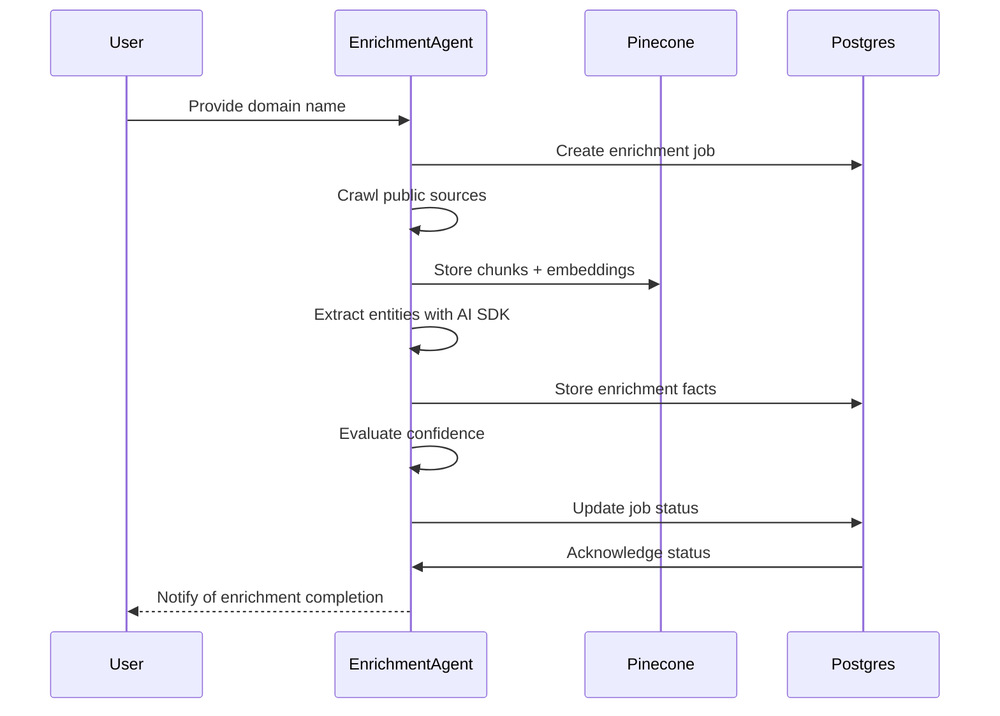

# Agent Workflow Design

## **Resilion Enrichment Pre-Loader POC**

---

## 1. Overview

This document describes the step-by-step workflow of the enrichment agent responsible for gathering, extracting, scoring, and persisting manufacturing site data from minimal customer-provided inputs (typically a domain name and corporate HQ).

The enrichment agent will execute a multi-stage pipeline with chaining logic, supporting retries and confidence-based validation.

---

## 2. Workflow Steps

**Step 1: Job Initialization**

- Accept domain name (and optional HQ location)
- Create a new enrichment job record in Postgres
    - status: pending
    - timestamp
    - enrichment_job_id

**Step 2: Crawl & Search**

- Query known sources:
    - corporate websites
    - press releases
    - third-party business directories
    - public data archives
- Download unstructured HTML/text content for processing

**Step 3: Chunk & Embed Evidence**

- Segment raw text into chunks
- Store chunks and their embeddings in Pinecone for semantic retrieval
- Link each chunk with `enrichment_job_id` for traceability

**Step 4: Entity Extraction**

- Use an AI SDK-based prompt to extract:
    - site_name
    - site_type
    - site_purpose
    - address
    - city
    - state
    - country
    - plant_manager
    - number_of_employees
    - operational_status
    - parent_company
    - geo_coordinates
    - supporting evidence text
- Validate the JSON output against the predefined schema
- Apply consistency checks (no empty site names, valid confidence score, etc.)

**Step 5: Confidence Scoring**

- Calculate or confirm a confidence score for each enrichment fact based on:
    - mention frequency
    - data source quality
    - location match to HQ
    - pattern match (address structure, company name match, etc.)
- Store confidence scores alongside the fact

**Step 6: Persistence**

- Persist enrichment facts to Postgres in JSONB columns
- Link each fact with the current enrichment job record

**Step 7: Chaining and Multi-Pass Logic**

- If a first enrichment pass only discovers partial information, allow:
    - a second pass focused on manager names
    - a third pass focused on revenue or supply chain dependencies
- Use job status to coordinate these passes, persisting intermediate facts
- Mark job complete only after all required passes succeed or confidence is acceptable

**Step 8: Error Handling and Retry**

- If errors occur (network, schema validation, timeouts):
    - mark job status as failed
    - store error message in the enrichment job record
    - support manual or automatic retry
- Avoid duplicate enrichment within a short time window

**Step 9: Finalization**

- Once all passes succeed with sufficient confidence, mark enrichment job as `completed`
- Signal downstream Resilion systems or reviewers to approve for promotion to production

---

## 3. Sequence Diagram

---

## 4. Agent Responsibilities

- Orchestrate multi-step enrichment
- Validate data structures
- Manage chaining, partial results, and retries
- Persist job-level and fact-level records
- Provide clear status updates to the front end

---

## 5. Frontend Visualization

- Display each enrichment step in a fixed Mermaid diagram
- Color-coded node status:
    - pending (gray)
    - running (blue)
    - success (green)
    - failed (red)
- Support manual refresh/polling for updates
- Expose fact JSONs for human inspection

---

## 6. Notes

- All chain states must be traceable to the `enrichment_job_id`
- Intermediate states should be preserved to support future HITL review
- Evidence text and embeddings stored in Pinecone allow context-based retrieval
- Future agent versions could expand to advanced knowledge graphs or more complex data sources

---